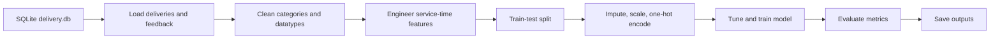

# AIAP 24 Delivery Machine Learning Pipeline

**Full name:** CHU MEI YING  
**Email:** mychuy2k@gmail.com

## Overview

This submission provides a script-based machine learning pipeline for the AIAP 24 delivery dataset. The pipeline reads `data/delivery.db` with SQLite, cleans operational fields, engineers delivery performance features, trains configurable models, evaluates results, and writes outputs into `outputs/ml`.

## Folder Structure

```text
.
├── config/
│   └── default_config.json
├── data/
│   └── delivery.db
├── outputs/
│   └── ml/
├── src/
│   ├── __init__.py
│   ├── config.py
│   ├── data_loader.py
│   ├── evaluation.py
│   ├── features.py
│   ├── main.py
│   ├── models.py
│   └── pipeline.py
├── eda.ipynb
├── README.md
├── requirements.txt
└── run.sh
```

## Execution And Parameter Changes

- Install dependencies with `pip install -r requirements.txt` before executing pipeline scripts.
- Run `bash run.sh` from the submission base folder.
- Change defaults inside `config/default_config.json` for repeatable experiments.
- Override model settings using command-line flags during quick trials.
- Review outputs in `outputs/ml` after every completed pipeline run.

Example commands:

```bash
bash run.sh
bash run.sh --no-tuning --learning-rate 0.03 --epochs 300
bash run.sh --task regression --model ridge_regression --no-tuning
```

## Pipeline Flow



## Logical Pipeline Steps

- Load deliveries and feedback tables through SQLite connection.
- Standardise dirty categories, datetimes, and numeric text fields.
- Engineer lateness, delivery duration, pickup wait, and calendar features.
- Train configured algorithm using holdout validation and tuning grid.
- Save metrics, predictions, tuning results, and feature coefficients.

## EDA Findings And Pipeline Choices

- Lateness strongly reduces ratings, so lateness features are engineered.
- Feedback is incomplete, so supervised training uses rated deliveries.
- Category labels contain typos, so text values are standardised.
- Priority tiers affect SLA risk, so priority is encoded categorically.
- Driver experience correlates positively, so tenure remains numeric feature.

## Quick EDA Summary From `eda.ipynb`

- Dataset contains 150,750 deliveries and 54,972 feedback rows.
- Feedback coverage is about 35.1 percent after joining records.
- Late deliveries average rating 2.97 versus 4.63 on time.
- Refrigerated parcels show highest category late rate, about 22.3 percent.
- Monthly late rate rises across the observed assessment window.

## Feature Processing Summary

| Feature group | Processing approach | Reason |
|---|---|---|
| Datetime fields | Convert to timestamps, derive durations | Capture operational service-time performance |
| Numeric fields | Coerce text, median impute, standardise | Stabilise gradient-based model training |
| Categorical fields | Strip, fix typos, one-hot encode | Preserve segment differences without ordering assumptions |
| Feedback rating | Filter observed ratings for training | Avoid learning from missing target labels |
| Target field | Binary low-rating or numeric rating | Supports classification and regression experiments |

- Datetime fields become delivery, pickup, promised, and lateness hours.
- Numeric fields are median-imputed, then standardised for training.
- Categorical fields are cleaned, typo-corrected, and one-hot encoded.
- Missing feedback targets are excluded from supervised model training.
- Target switches between low-rating classification and rating regression.

## Model Choices

- Logistic regression predicts low-rating risk with interpretable linear coefficients.
- Ridge regression predicts rating values using regularised numeric optimization.
- Gradient descent implementation avoids unnecessary heavy external dependencies.
- L2 regularisation reduces overfitting across many encoded categorical features.
- Configurable grids support learning-rate, epoch, and penalty experimentation.

## Assessment Criteria Coverage

- Data preprocessing cleans labels, coerces types, imputes missingness, and scales numerics.
- Feature engineering creates SLA, duration, calendar, and customer satisfaction variables.
- Algorithm optimization searches configured learning rates and regularisation strengths.
- Model choices balance interpretability, portability, and assessment reproducibility.
- Evaluation metrics match classification risk and regression error objectives.
- Pipeline components separate loading, features, models, evaluation, and orchestration.

## Evaluation Metrics Rationale

- Accuracy shows overall low-rating classification correctness across holdout records.
- Precision measures reliability when pipeline predicts dissatisfied customers.
- Recall measures ability to capture actual low-rating deliveries.
- F1 balances precision and recall under class imbalance.
- ROC AUC measures ranking quality across classification thresholds.
- MAE, RMSE, and R2 evaluate continuous rating regression performance.

## Code Quality: Reusability

- Config files and CLI flags enable repeated experiments without code edits.
- Loader, preprocessor, models, and evaluator are separated into modules.
- Pipeline class orchestrates reusable steps for multiple task types.

## Code Quality: Readability

- Each module has one main responsibility and clear function names.
- Configuration mirrors pipeline stages, reducing hidden assumptions.
- Output filenames clearly describe metrics, predictions, and coefficients.

## Code Quality: Self-Explanatory Design

- Feature names are preserved after preprocessing for coefficient inspection.
- README links EDA findings directly to engineered feature choices.
- Saved JSON summaries expose parameters, metrics, and selected model settings.

## Outputs

After execution, the pipeline writes:

- `outputs/ml/metrics.json`
- `outputs/ml/tuning_results.json`
- `outputs/ml/predictions.csv`
- `outputs/ml/feature_coefficients.csv`

The default pipeline trains a low-rating classifier where ratings `1`, `2`, and `3` are treated as dissatisfied outcomes.
